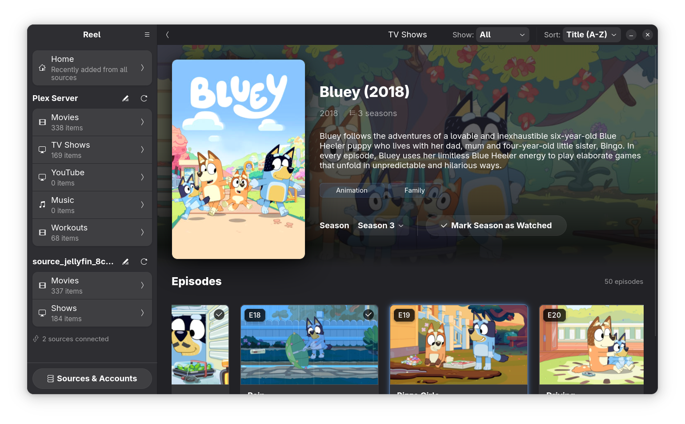

<div align="center">
  
  
  # 🎬 Reel
  
  **A modern GTK4 media player for GNOME, built with Rust for performance and reliability.**
</div>

> **⚠️ Early Development**: Reel is actively being developed. Expect rough edges, missing features, and breaking changes as we work toward a stable release.

## What is Reel?

Reel is a native Linux media player that brings your Plex (and soon Jellyfin) libraries to the GNOME desktop. Written entirely in Rust, it leverages the language's performance and memory safety to deliver a fast, reliable media experience without the overhead of web technologies.




### ✨ Key Features

- **🦀 Pure Rust Implementation**: Fast, memory-safe, and concurrent by design
- **🔌 Multi-Backend Architecture**: Currently supports Plex, with Jellyfin and local files planned
- **💾 Offline-First Design**: SQLite caching keeps your library browsable even offline
- **🎨 Native GTK4/libadwaita**: Seamlessly integrates with modern GNOME desktops
- **⚡ Async Everything**: Built on Tokio for responsive, non-blocking operations
- **🎥 GStreamer Playback**: Hardware-accelerated video with comprehensive codec support

## 🚀 Getting Started

This project uses Nix flakes to manage the development environment, ensuring all dependencies (including GStreamer plugins and GTK schemas) are properly configured.

### Prerequisites

- Nix with flakes enabled
- Git

### Building with Nix

```bash
# Clone the repository
git clone https://github.com/yourusername/reel.git
cd reel

# Enter the Nix development shell
nix develop

# Build the Rust project
cargo build

# Run the application
cargo run
```

### Development Commands

Inside the Nix shell:

```bash
# Format Rust code
cargo fmt

# Run Clippy lints
cargo clippy

# Run test suite
cargo test

# Build optimized release binary
cargo build --release
```

## 📦 Installation

### Nix/NixOS

```bash
# Run directly with Nix flakes
nix run github:yourusername/reel
```

### Flatpak

🚧 **Coming Soon** - Flatpak packaging is planned to make Reel available across all Linux distributions.

## 🏗️ Architecture

Reel follows Rust best practices with a clean separation of concerns:

```
UI Layer (GTK4/Blueprint templates)
    ↓
Application State (Arc<RwLock> shared state)
    ↓
Service Layer (Tokio async services)
    ↓
Backend Trait (Generic MediaBackend interface)
    ↓
Implementations (Plex, Jellyfin, Local)
```

The entire codebase leverages Rust's type system and ownership model to prevent common bugs at compile time, while async/await enables efficient handling of network requests and media operations.

## 📊 Project Status

See [TASKS.md](TASKS.md) for the detailed development roadmap.

### ✅ Completed Features
- **Authentication & Server Management**
  - Plex OAuth authentication with PIN-based flow
  - Automatic server discovery and connection
  - Multi-backend architecture supporting Plex, Jellyfin (planned), and local files (planned)
  - Persistent authentication and server preferences

- **Media Browsing & Playback**
  - Complete movie and TV show libraries with grid views
  - Cinematic detail pages with backdrop images and metadata
  - GStreamer-based video playback with hardware acceleration
  - Immersive player with auto-hiding controls
  - Watch status tracking and progress indicators
  - Continue watching and recently added sections

- **Performance & Architecture**
  - Multi-level image caching (memory + disk) with request coalescing
  - HTTP/2 connection pooling for faster API calls
  - Lazy loading with viewport-based rendering
  - SQLite-based offline cache for instant startup
  - Backend-agnostic UI architecture for extensibility
  - Async/await throughout with Tokio runtime

- **User Experience**
  - Homepage with dynamic content sections
  - Library filtering (watched/unwatched) and sorting
  - Library visibility management
  - Modern Blueprint-based UI with GNOME HIG compliance
  - Smooth transitions and loading states

### 🔧 In Development
- Fullscreen playback mode
- Playback position syncing to server
- Advanced filtering (genre, year, rating)
- Search functionality

### 📋 Roadmap
- **v0.2.0** - Jellyfin backend integration
- **v0.3.0** - Local file support with metadata providers
- **v0.4.0** - Offline download manager
- **v0.5.0** - Music library support
- **v1.0.0** - Stable release with complete feature set

## 🛠️ Tech Stack

- **Language**: Rust 2021 edition
- **UI Framework**: GTK4 + libadwaita via [gtk-rs](https://gtk-rs.org/)
- **Async Runtime**: [Tokio](https://tokio.rs/)
- **Database**: SQLite with [SQLx](https://github.com/launchbadge/sqlx)
- **HTTP Client**: [Reqwest](https://github.com/seanmonstar/reqwest)
- **Video Playback**: GStreamer via [gstreamer-rs](https://gitlab.freedesktop.org/gstreamer/gstreamer-rs)
- **Serialization**: [Serde](https://serde.rs/)

## 🤝 Contributing

Contributions are welcome! Since this is an early-stage Rust project, please check [TASKS.md](TASKS.md) for areas needing work. The codebase follows standard Rust conventions - run `cargo fmt` and `cargo clippy` before submitting PRs.

## 📄 License

[License details to be determined]

## 🙏 Acknowledgments

Built with excellent Rust crates and GNOME technologies:
- The [gtk-rs](https://gtk-rs.org/) team for exceptional Rust bindings
- [GNOME](https://www.gnome.org/) for the beautiful desktop platform
- The Rust community for an amazing ecosystem of crates